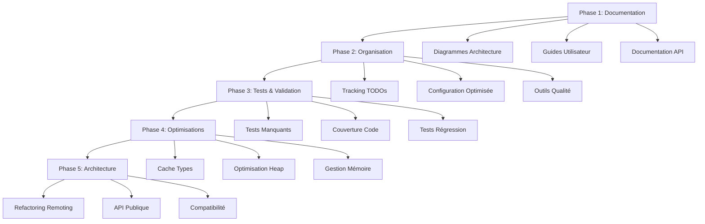

# Design Document - MTGOSDK Improvements

## Overview

Ce document présente la conception des améliorations pour le projet MTGOSDK. L'approche privilégie les améliorations à faible risque et haute valeur ajoutée, en commençant par la documentation et l'organisation, puis en progressant vers les optimisations techniques.

## Architecture

### Approche par Phases



## Components and Interfaces

### 1. Documentation System

#### Architecture Diagrams
- **SDK Overview Diagram** : Vue d'ensemble des composants principaux
- **Build Process Diagram** : Flux de génération de code MSBuild
- **Remoting Architecture** : Interaction avec le client MTGO
- **Memory Management** : Gestion du heap et des objets distants

#### User Guides
- **Quick Start Guide** : Guide de démarrage en 5 minutes
- **API Reference** : Documentation complète des APIs publiques
- **Examples Collection** : Exemples pratiques commentés
- **Troubleshooting Guide** : Solutions aux problèmes courants

### 2. TODO Management System

#### TODO Tracker
```markdown
# Structure du fichier TODO-TRACKER.md
## 🟢 Autonome (Kiro peut résoudre)
## 🟡 Collaboration requise
## 🔴 Expertise technique requise
```

#### Classification
- **Priorité** : Critique, Haute, Moyenne, Basse
- **Complexité** : Simple, Modérée, Complexe
- **Type** : Documentation, Performance, Bug, Feature
- **Statut** : Todo, En cours, Terminé, Bloqué

### 3. Configuration Optimization

#### Development Environment
- **EditorConfig** : Règles de formatage optimisées
- **MSBuild** : Configuration de build optimisée
- **Code Quality** : Analyseurs et linters configurés
- **Git Hooks** : Validation automatique pre-commit

#### Build Performance
- **Incremental Build** : Optimisation des builds incrémentaux
- **Parallel Compilation** : Compilation parallèle optimisée
- **Cache Strategy** : Stratégie de cache pour les artefacts
- **Package Management** : Gestion optimisée des packages NuGet

### 4. Testing Framework

#### Test Categories
- **Unit Tests** : Tests unitaires pour chaque composant
- **Integration Tests** : Tests d'intégration avec MTGO
- **Performance Tests** : Tests de performance et benchmarks
- **Regression Tests** : Tests de non-régression

#### Coverage Strategy
- **Code Coverage** : Mesure et reporting de la couverture
- **API Coverage** : Validation de toutes les APIs publiques
- **Scenario Coverage** : Tests des scénarios utilisateur principaux

## Data Models

### TODO Item Model
```csharp
public class TodoItem
{
    public string Id { get; set; }
    public string Description { get; set; }
    public string FilePath { get; set; }
    public int LineNumber { get; set; }
    public TodoPriority Priority { get; set; }
    public TodoComplexity Complexity { get; set; }
    public TodoType Type { get; set; }
    public TodoStatus Status { get; set; }
    public string AssignedTo { get; set; }
    public DateTime CreatedDate { get; set; }
    public DateTime? CompletedDate { get; set; }
}
```

### Documentation Structure
```
docs/
├── architecture/
│   ├── overview.md (✅ exists)
│   ├── sdk-architecture.md (➕ new)
│   ├── build-process.md (➕ new)
│   ├── remoting-system.md (➕ new)
│   └── diagrams/ (➕ new)
├── guides/
│   ├── quick-start.md (➕ new)
│   ├── advanced-usage.md (➕ new)
│   ├── troubleshooting.md (➕ new)
│   └── contributing.md (➕ new)
├── api-reference/ (➕ new)
└── examples/ (➕ new)
```

## Error Handling

### Documentation Errors
- **Missing Files** : Génération automatique de stubs
- **Broken Links** : Validation et correction automatique
- **Outdated Content** : Système d'alerte pour contenu obsolète

### Build Errors
- **Configuration Issues** : Validation et suggestions de correction
- **Dependency Conflicts** : Résolution automatique quand possible
- **Performance Degradation** : Monitoring et alertes

### Runtime Errors
- **MTGO Connection** : Retry logic et fallback strategies
- **Type Resolution** : Cache et error recovery
- **Memory Management** : Leak detection et cleanup automatique

## Testing Strategy

### Phase 1 Testing (Documentation)
- **Link Validation** : Vérification de tous les liens
- **Markdown Linting** : Validation de la syntaxe
- **Diagram Generation** : Tests de génération des diagrammes
- **Content Completeness** : Vérification de la complétude

### Phase 2 Testing (Organisation)
- **TODO Tracking** : Validation du système de tracking
- **Configuration** : Tests des configurations optimisées
- **Build Performance** : Benchmarks des temps de build

### Phase 3 Testing (Tests & Validation)
- **Test Coverage** : Mesure de la couverture de code
- **API Validation** : Tests de toutes les APIs publiques
- **Regression Testing** : Tests de non-régression automatisés

### Phase 4 Testing (Optimisations)
- **Performance Benchmarks** : Mesure des améliorations
- **Memory Profiling** : Validation de l'utilisation mémoire
- **Load Testing** : Tests sous charge

### Phase 5 Testing (Architecture)
- **Compatibility Testing** : Tests de compatibilité MTGO
- **API Stability** : Tests de stabilité des APIs
- **Integration Testing** : Tests d'intégration complets

## Implementation Approach

### Autonomous Tasks (Kiro can handle)
1. **Documentation Creation** : Génération de toute la documentation manquante
2. **TODO Organization** : Création du système de tracking
3. **Configuration Optimization** : Amélioration des fichiers de config
4. **Basic Testing** : Ajout des tests unitaires manquants

### Collaborative Tasks (Requires validation)
1. **Performance Optimizations** : Propositions d'optimisation à valider
2. **API Changes** : Modifications des APIs publiques
3. **Architecture Decisions** : Changements architecturaux majeurs
4. **CI/CD Modifications** : Changements des workflows

### Expert Tasks (Requires deep technical knowledge)
1. **Memory Management** : Optimisations avancées du heap
2. **MTGO Integration** : Modifications de l'injection de processus
3. **Type System** : Améliorations du système de types distants
4. **Security** : Améliorations de sécurité