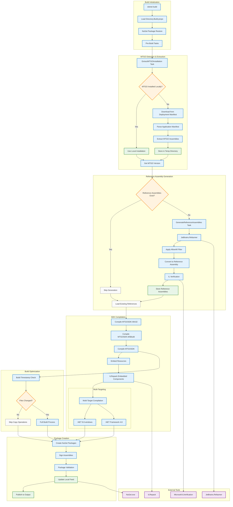

# MTGOSDK Build Process Diagram

## Vue d'ensemble du processus de build



## Phases du processus de build

### 1. Initialisation du Build
- **Chargement des propriétés** : Directory.Build.props définit les chemins et configurations
- **Restauration NuGet** : Téléchargement des dépendances avec lock files
- **Tâches pré-build** : Préparation de l'environnement de compilation

### 2. Détection et Extraction MTGO
- **Détection locale** : Recherche d'une installation MTGO existante
- **Téléchargement** : Si absent, téléchargement depuis le manifest de déploiement
- **Extraction** : Extraction des assemblies MTGO dans un répertoire temporaire
- **Versioning** : Détermination de la version MTGO pour la compatibilité

### 3. Génération des Assemblies de Référence
- **Vérification cache** : Contrôle si les références existent déjà pour cette version
- **Génération Refasmer** : Conversion des assemblies MTGO en références
- **Filtrage** : Application du filtre AllowAll pour exposer tous les types publics
- **Validation IL** : Vérification de la validité du code IL généré

### 4. Compilation du SDK
- **Compilation séquentielle** : Win32 → MSBuild → SDK principal
- **Intégration ressources** : Embedding des composants Launcher et ScubaDiver
- **ILRepack** : Fusion des assemblies embarqués
- **Multi-targeting** : Compilation pour .NET 9 et .NET Framework 4.8

### 5. Optimisations de Build
- **Timestamps** : Comparaison des horodatages pour éviter les recompilations
- **Build incrémental** : Skip des opérations si aucun changement détecté
- **Cache intelligent** : Réutilisation des artefacts précédents

### 6. Création des Packages
- **Packaging NuGet** : Création des packages .nupkg et .snupkg
- **Signature** : Signature des assemblies pour la sécurité
- **Validation** : Validation de l'intégrité des packages
- **Feed local** : Mise à jour du feed NuGet local pour les tests

## Outils et Technologies

### Outils de Build
- **JetBrains.Refasmer** : Génération d'assemblies de référence
- **Microsoft.ILVerification** : Validation du code IL
- **ILRepack** : Fusion d'assemblies
- **NuGet.exe** : Gestion des packages

### Optimisations MSBuild
- **Builds déterministes** : Reproductibilité des builds
- **Compilation parallèle** : Utilisation de tous les cœurs CPU
- **Cache de packages** : Réutilisation des packages téléchargés
- **Builds incrémentaux** : Compilation uniquement des fichiers modifiés

## Configuration Avancée

### Multi-Targeting Strategy
```xml
<TargetFrameworks>net9.0-windows;$(MTGOSDKCoreTFM)</TargetFrameworks>
```
- **.NET 9.0-windows** : Version moderne avec toutes les fonctionnalités
- **.NET Framework 4.8** : Compatibilité avec MTGO (même runtime)

### Build Conditionals
- **Windows uniquement** : Certaines tâches ne s'exécutent que sur Windows
- **Mode développement** : Feed local activé avec `UseLocalFeed=true`
- **CI/CD** : Builds déterministes avec `ContinuousIntegrationBuild=true`

### Performance Optimizations
- **Timestamp Comparison** : Évite les recompilations inutiles
- **Parallel Restore** : Restauration parallèle des packages
- **Incremental Linking** : Liaison incrémentale des assemblies
- **Output Caching** : Cache des sorties de compilation