# MTGOSDK Architecture Diagram

## Vue d'ensemble de l'architecture

```mermaid
graph TB
    subgraph "MTGOSDK Ecosystem"
        subgraph "Core SDK Package"
            SDK[MTGOSDK]
            subgraph "API Layer"
                API_CLIENT[Client.cs]
                API_CHAT[Chat API]
                API_COLLECTION[Collection API]
                API_PLAY[Play API]
                API_TRADE[Trade API]
                API_USERS[Users API]
            end
            
            subgraph "Core Layer"
                CORE_REMOTING[Remoting System]
                CORE_MEMORY[Memory Management]
                CORE_REFLECTION[Reflection Extensions]
                CORE_COMPILER[IL Compiler]
                CORE_SECURITY[Security]
            end
            
            subgraph "Embedded Components"
                LAUNCHER[Launcher]
                SCUBADIVER[ScubaDiver]
                BOOTSTRAPPER[Bootstrapper]
            end
        end
        
        subgraph "Build-Time Package"
            MSBUILD[MTGOSDK.MSBuild]
            CODEGEN[Code Generation]
            REFASM[Reference Assemblies]
            ILVERIFY[IL Verification]
        end
        
        subgraph "Platform Package"
            WIN32[MTGOSDK.Win32]
            WIN32_API[Win32 APIs]
            REGISTRY[Registry Access]
            DISASM[Disassembler]
        end
    end
    
    subgraph "External Dependencies"
        CLRMD[Microsoft.Diagnostics.Runtime]
        IMPROMPTU[ImpromptuInterface]
        HARMONY[Lib.Harmony]
        REFASMER[JetBrains.Refasmer]
    end
    
    subgraph "MTGO Client"
        MTGO_PROCESS[MTGO.exe Process]
        MTGO_HEAP[Managed Heap]
        MTGO_OBJECTS[Game Objects]
    end
    
    subgraph "User Applications"
        USER_APP[Your Application]
        EXAMPLES[SDK Examples]
    end
    
    %% Dependencies
    SDK --> WIN32
    MSBUILD --> WIN32
    SDK --> CLRMD
    SDK --> IMPROMPTU
    SCUBADIVER --> HARMONY
    MSBUILD --> REFASMER
    
    %% Build-time relationships
    MSBUILD -.->|"Generates"| REFASM
    MSBUILD -.->|"Creates"| CODEGEN
    REFASM -.->|"Used by"| SDK
    
    %% Runtime relationships
    USER_APP --> API_CLIENT
    API_CLIENT --> CORE_REMOTING
    CORE_REMOTING --> CLRMD
    LAUNCHER -->|"Injects"| SCUBADIVER
    SCUBADIVER -->|"Hooks into"| MTGO_PROCESS
    CORE_MEMORY -->|"Reads"| MTGO_HEAP
    CORE_REFLECTION -->|"Inspects"| MTGO_OBJECTS
    
    %% Platform integration
    WIN32_API -->|"Process Management"| MTGO_PROCESS
    REGISTRY -->|"MTGO Detection"| MTGO_PROCESS
    
    %% Styling
    classDef corePackage fill:#e1f5fe,stroke:#01579b,stroke-width:2px
    classDef buildPackage fill:#f3e5f5,stroke:#4a148c,stroke-width:2px
    classDef platformPackage fill:#e8f5e8,stroke:#1b5e20,stroke-width:2px
    classDef external fill:#fff3e0,stroke:#e65100,stroke-width:1px
    classDef mtgo fill:#ffebee,stroke:#c62828,stroke-width:2px
    classDef user fill:#f1f8e9,stroke:#33691e,stroke-width:2px
    
    class SDK,API_CLIENT,API_CHAT,API_COLLECTION,API_PLAY,API_TRADE,API_USERS,CORE_REMOTING,CORE_MEMORY,CORE_REFLECTION,CORE_COMPILER,CORE_SECURITY,LAUNCHER,SCUBADIVER,BOOTSTRAPPER corePackage
    class MSBUILD,CODEGEN,REFASM,ILVERIFY buildPackage
    class WIN32,WIN32_API,REGISTRY,DISASM platformPackage
    class CLRMD,IMPROMPTU,HARMONY,REFASMER external
    class MTGO_PROCESS,MTGO_HEAP,MTGO_OBJECTS mtgo
    class USER_APP,EXAMPLES user
```

## Composants principaux

### MTGOSDK (Package principal)
Le package principal fournit l'API publique pour interagir avec MTGO :

- **API Layer** : APIs haut niveau pour Chat, Collection, Play, Trade, Users
- **Core Layer** : Système de remoting, gestion mémoire, réflection, compilation IL
- **Embedded Components** : Launcher, ScubaDiver (injectés dans MTGO)

### MTGOSDK.MSBuild (Package de build)
Gère la génération de code au moment de la compilation :

- **Code Generation** : Génère les bindings API
- **Reference Assemblies** : Crée les assemblies de référence MTGO
- **IL Verification** : Valide le code généré

### MTGOSDK.Win32 (Package plateforme)
Fournit les APIs Win32 nécessaires :

- **Win32 APIs** : Définitions des APIs système
- **Registry Access** : Accès au registre Windows
- **Disassembler** : Désassemblage de code natif

## Flux d'exécution

1. **Build Time** : MTGOSDK.MSBuild génère les assemblies de référence
2. **Runtime** : L'application utilisateur utilise l'API MTGOSDK
3. **Injection** : Le Launcher injecte ScubaDiver dans le processus MTGO
4. **Remoting** : Le système de remoting établit la communication
5. **Memory Access** : ClrMD permet l'accès au heap managé de MTGO
6. **Object Inspection** : Les objets MTGO sont inspectés via réflection

## Technologies clés

- **ClrMD** : Accès au heap managé et debugging
- **ImpromptuInterface** : Création de proxies dynamiques
- **Harmony** : Patching et hooking de méthodes
- **Refasmer** : Génération d'assemblies de référence