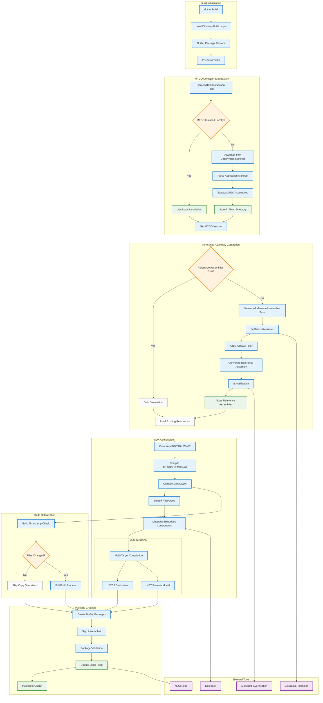

# MTGOSDK Build Process Diagram

## Vue d'ensemble du processus de build



## Phases du processus de build

### 1. Initialisation du Build
- **Chargement des propriétés** : Directory.Build.props définit les chemins et configurations
- **Restauration NuGet** : Téléchargement des dépendances avec lock files
- **Tâches pré-build** : Préparation de l'environnement de compilation

### 2. MTGO Detection and Extraction
- **Local detection**: Search for existing MTGO installation
- **Download**: If absent, download from deployment manifest
- **Extraction**: Extract MTGO assemblies to temporary directory
- **Versioning**: Determine MTGO version for compatibility

### 3. Reference Assembly Generation
- **Cache verification**: Check if references already exist for this version
- **Refasmer generation**: Convert MTGO assemblies to references
- **Filtering**: Apply AllowAll filter to expose all public types
- **IL validation**: Verify generated IL code validity

### 4. SDK Compilation
- **Sequential compilation**: Win32 → MSBuild → Main SDK
- **Resource integration**: Embedding Launcher and ScubaDiver components
- **ILRepack**: Merge embedded assemblies
- **Multi-targeting**: Compilation for .NET 9 and .NET Framework 4.8

### 5. Build Optimizations
- **Timestamps**: Compare timestamps to avoid unnecessary recompilations
- **Incremental build**: Skip operations if no changes detected
- **Cache intelligent** : Réutilisation des artefacts précédents

### 6. Création des Packages
- **Packaging NuGet** : Création des packages .nupkg et .snupkg
- **Signature** : Signature des assemblies pour la sécurité
- **Validation** : Validation de l'intégrité des packages
- **Feed local** : Mise à jour du feed NuGet local pour les tests

## Outils et Technologies

### Outils de Build
- **JetBrains.Refasmer** : Génération d'assemblies de référence
- **Microsoft.ILVerification** : Validation du code IL
- **ILRepack** : Fusion d'assemblies
- **NuGet.exe** : Gestion des packages

### Optimisations MSBuild
- **Builds déterministes** : Reproductibilité des builds
- **Compilation parallèle** : Utilisation de tous les cœurs CPU
- **Cache de packages** : Réutilisation des packages téléchargés
- **Builds incrémentaux** : Compilation uniquement des fichiers modifiés

## Configuration Avancée

### Multi-Targeting Strategy
```xml
<TargetFrameworks>net9.0-windows;$(MTGOSDKCoreTFM)</TargetFrameworks>
```
- **.NET 9.0-windows** : Version moderne avec toutes les fonctionnalités
- **.NET Framework 4.8** : Compatibilité avec MTGO (même runtime)

### Build Conditionals
- **Windows uniquement** : Certaines tâches ne s'exécutent que sur Windows
- **Mode développement** : Feed local activé avec `UseLocalFeed=true`
- **CI/CD** : Builds déterministes avec `ContinuousIntegrationBuild=true`

### Performance Optimizations
- **Timestamp Comparison** : Évite les recompilations inutiles
- **Parallel Restore** : Restauration parallèle des packages
- **Incremental Linking** : Liaison incrémentale des assemblies
- **Output Caching** : Cache des sorties de compilation