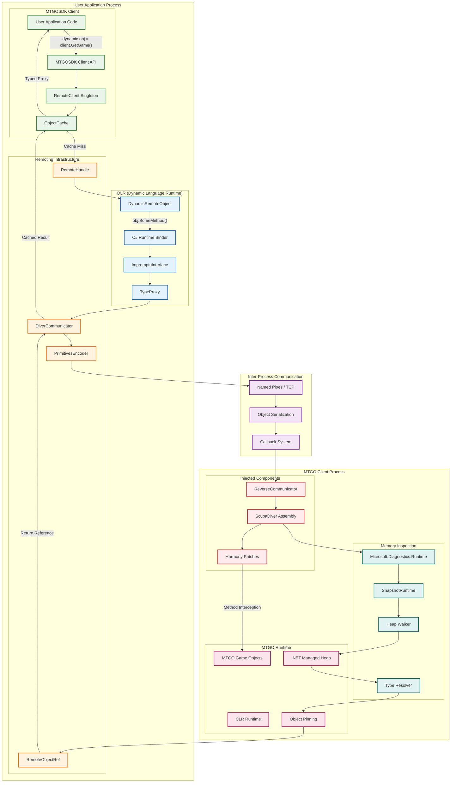
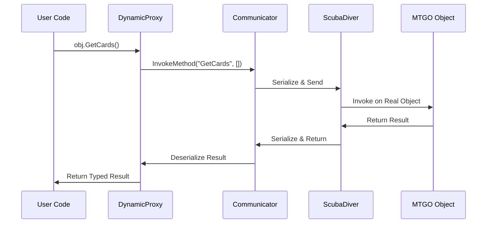

# MTGOSDK Remoting System & DLR Architecture

## Vue d'ensemble du système de remoting



## Architecture détaillée du système de remoting

### 1. Couche Utilisateur (User Space)

#### Client API
```csharp
// L'utilisateur interagit avec des objets typés
var client = RemoteClient.@this;
var game = client.GetGame(); // Retourne un proxy dynamique
dynamic gameState = game.CurrentState; // Navigation transparente
```

#### Object Cache
- **Cache intelligent** : Évite les appels répétés au processus distant
- **Weak References** : Permet le garbage collection des objets non utilisés
- **Type Safety** : Maintient les informations de type pour les proxies

### 2. Dynamic Language Runtime (DLR)

#### DynamicRemoteObject
```csharp
public class DynamicRemoteObject : DynamicObject
{
    // Intercepte tous les appels de méthodes/propriétés
    public override bool TryInvokeMember(InvokeMemberBinder binder, 
                                       object[] args, out object result)
    {
        // Résolution dynamique et appel distant
    }
}
```

#### ImpromptuInterface Integration
- **Typed Proxies** : Conversion des objets dynamiques en interfaces typées
- **Compile-time Safety** : Vérification des types à la compilation
- **Performance** : Cache des delegates pour les appels répétés

### 3. Infrastructure de Remoting

#### Communication Pipeline


#### Object Reference Management
- **Pinning Strategy** : Les objets MTGO sont "épinglés" en mémoire
- **Address Tracking** : Suivi des adresses mémoire des objets distants
- **Lifecycle Management** : Nettoyage automatique des références

### 4. Injection et Hooking

#### ScubaDiver Assembly
```csharp
// Injecté dans le processus MTGO
public class ScubaDiver
{
    // Point d'entrée pour les appels distants
    public object InvokeMethod(ulong objectAddress, string methodName, object[] args)
    {
        // Résolution de l'objet depuis l'adresse
        // Invocation de la méthode via réflection
        // Retour du résultat sérialisé
    }
}
```

#### Harmony Patches
- **Method Interception** : Interception des méthodes MTGO critiques
- **Event Hooking** : Capture des événements du jeu
- **State Monitoring** : Surveillance des changements d'état

### 5. Memory Management avec ClrMD

#### Heap Inspection
```csharp
// Accès direct au heap managé de MTGO
var runtime = DataTarget.AttachToProcess(mtgoProcess.Id).ClrVersions[0].CreateRuntime();
foreach (var obj in runtime.Heap.EnumerateObjects())
{
    // Inspection des objets sans les modifier
    var type = obj.Type;
    var fields = type.Fields;
}
```

#### Type Resolution
- **Dynamic Type Loading** : Chargement des types MTGO à la volée
- **Generic Support** : Gestion des types génériques complexes
- **Assembly Resolution** : Résolution des assemblies MTGO

## Flux d'exécution détaillé

### 1. Initialisation
1. **Process Attachment** : Attachement au processus MTGO via ClrMD
2. **Injection** : Injection de ScubaDiver dans le processus cible
3. **Communication Setup** : Établissement du canal de communication
4. **Type Discovery** : Découverte des types MTGO disponibles

### 2. Appel de Méthode
1. **Dynamic Binding** : Le DLR résout l'appel de méthode
2. **Serialization** : Sérialisation des paramètres
3. **IPC Transfer** : Transfert via Named Pipes ou TCP
4. **Remote Execution** : Exécution dans le processus MTGO
5. **Result Return** : Retour du résultat sérialisé
6. **Proxy Creation** : Création d'un proxy pour le résultat

### 3. Gestion Mémoire
1. **Object Pinning** : Épinglage des objets référencés
2. **Weak References** : Utilisation de références faibles côté client
3. **Garbage Collection** : Nettoyage automatique des objets non utilisés
4. **Memory Pressure** : Gestion de la pression mémoire

## Advantages of this Architecture

### Performance
- **Lazy Loading** : Chargement à la demande des objets
- **Intelligent Caching** : Cache multi-niveaux pour éviter les appels répétés
- **Batch Operations** : Regroupement des opérations pour réduire la latence

### Robustesse
- **Error Recovery** : Récupération automatique des erreurs de communication
- **Process Isolation** : Isolation complète entre SDK et MTGO
- **Memory Safety** : Pas de corruption mémoire possible

### Flexibilité
- **Dynamic Typing** : Support complet du typage dynamique C#
- **Type Safety** : Conversion vers des interfaces typées quand nécessaire
- **Extensibility** : Architecture extensible pour nouveaux types d'objets

## Technologies Clés

- **Microsoft.Diagnostics.Runtime (ClrMD)** : Inspection du heap managé
- **ImpromptuInterface** : Conversion dynamic → typed interfaces
- **Lib.Harmony** : Patching et hooking de méthodes
- **C# DLR** : Dynamic Language Runtime pour les appels dynamiques
- **Named Pipes/TCP** : Communication inter-processus